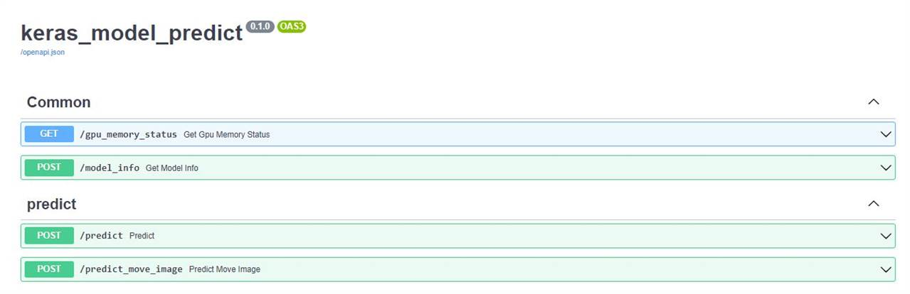

# keras_model_predict_fastAPI
## 介紹：
* 使用fastAPI實作keras model predict webAPI。
* application/routers : 提供 4 個 API。
   - 1. get_gpu_memory_status : 查詢當前 GPU 狀態。
   - 2. get_model_info : 獲取 model 基本的 input / output shape。
   - 3. predict : 執行模型圖片辨識 (適用於 binary 與 multiclass)，且可output excel (儲存至指定位置)。
   - 4. predict_move_image : 除了上述功能外，提供圖片歸類功能 (依 class 分資料夾)。
* model predict 適用於 binary, multiclass 與 1 / 3 channel。
* utility/loadModel : 讀取模型資訊，並依照需求分配 CPU / GPU。 
* utility/predictor : 主要的 predict 方法建立。
* utility/predictDataHandler : 依照不同 output (binary, multiclass) 處理 prediction 結果。
* utility/setLogging : 使用 logging 紀錄 api 執行中的過程 與 request IP。
* utility/timer : 使用 timer 計算每次 predict 的 FPS。
   
## 文件：
